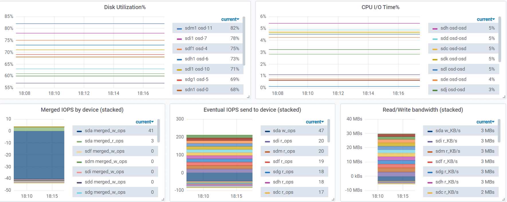
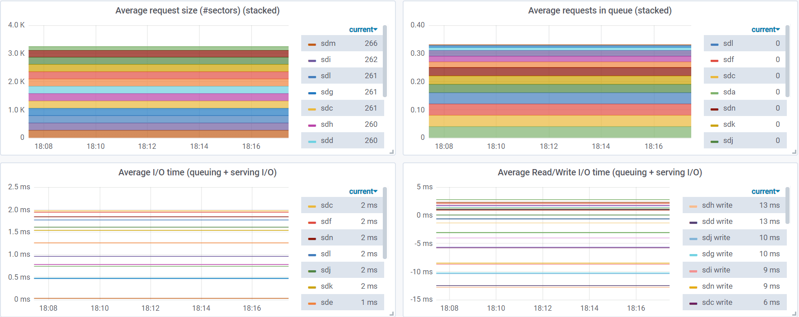

# Ceph disk metrics

Collecting metrics of Ceph disks:

* disk usage
* iostat

```
$ ./ceph-metrics.sh
ceph.node.disk_utilization{"device":"sdc1", "osd":"1"} 60
ceph.node.disk_utilization{"device":"sdd1", "osd":"2"} 68
...
ceph.node.iostat.merged_r_ops{"device":"sda"} 3.23
ceph.node.iostat.merged_w_ops{"device":"sda"} 40.18
ceph.node.iostat.r_ops{"device":"sda"} 2.22
ceph.node.iostat.w_ops{"device":"sda"} 46.53
ceph.node.iostat.r_kbps{"device":"sda"} 92.30
ceph.node.iostat.w_kbps{"device":"sda"} 3194.34
ceph.node.iostat.avg_request_size{"device":"sda"} 134.83
ceph.node.iostat.avg_queue_size{"device":"sda"} 0.03
ceph.node.iostat.await{"device":"sda"} 0.64
ceph.node.iostat.r_await{"device":"sda"} 2.79
ceph.node.iostat.w_await{"device":"sda"} 0.54
ceph.node.iostat.svctm{"device":"sda"} 0.57
ceph.node.iostat.util{"device":"sda"} 2.79
...
```

Those metrics are printed in Prometheus format.

## Dashboard

<p align="center"></p>
<p align="center"></p>
