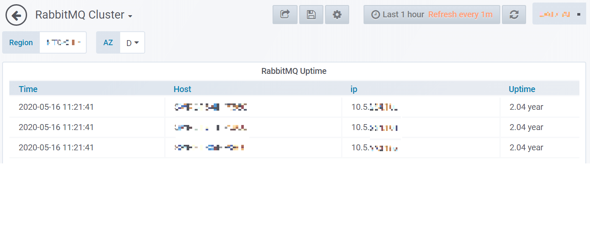
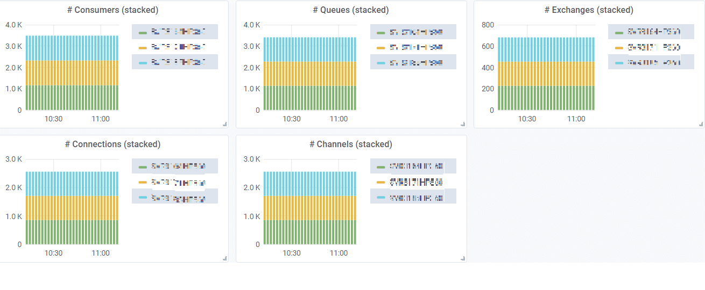
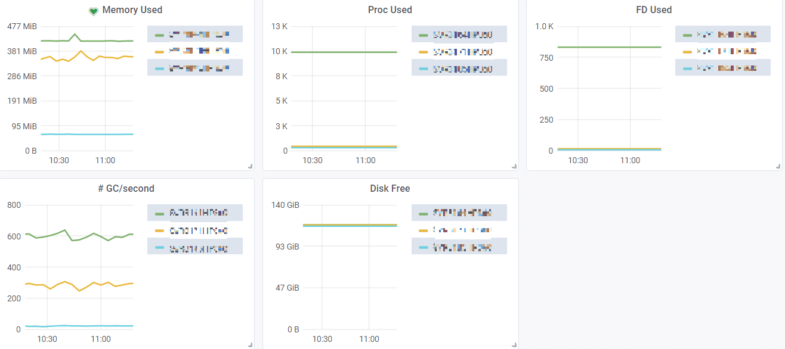
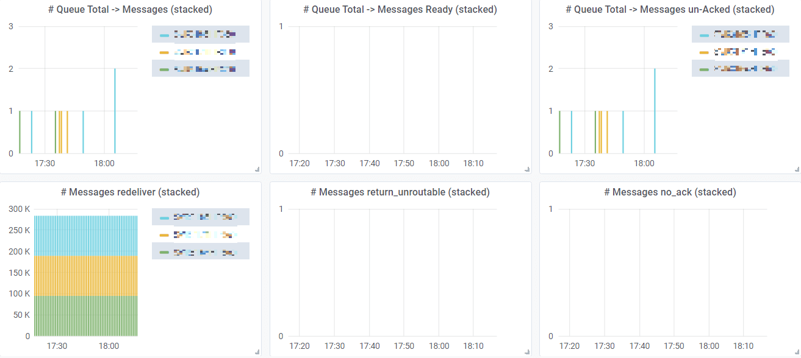

## Setup

Enable management API:

```shell
$ cat /etc/rabbitmq/enabled_plugins
[rabbitmq_management].

$ service restart rabbitmq
```

Test:

```shell
$ curl -u guest:guest localhost:15672/api/overview
{"management_version":"3.6.6","rates_mode":"basic","exchange_types":[{"name":"topic",
"description":"AMQP topic exchange, as per the AMQP specification","enabled":true},
...
```

Better output:

```shell
$ curl -u guest:guest localhost:15672/api/overview 2>/dev/null | jq . -
{
  "management_version": "3.6.6",
  "rates_mode": "basic",
  "exchange_types": [
    {
      "name": "topic",
      "description": "AMQP topic exchange, as per the AMQP specification",
      "enabled": true
    },
    ...
  ],
  "rabbitmq_version": "3.6.6",
  ...
```

## Collect Metric

```shell
$ python rabbitmq_metrics.py
rabbitmq.overview.rabbitmq_version{"node": "rabbit@rabbitmq03"} 3.6.6
rabbitmq.overview.channels{"node": "rabbit@rabbitmq03"} 1287.00
rabbitmq.overview.connections{"node": "rabbit@rabbitmq03"} 1542.00
rabbitmq.overview.exchanges{"node": "rabbit@rabbitmq03"} 297.00
rabbitmq.overview.queues{"node": "rabbit@rabbitmq03"} 1198.00
rabbitmq.overview.consumers{"node": "rabbit@rabbitmq03"} 1306.00
...
rabbitmq.node.proc_used{"node": "rabbit@rabbitmq03"} 312.00
rabbitmq.node.sockets_used{"node": "rabbit@rabbitmq03"} 11.00
rabbitmq.node.fd_used{"node": "rabbit@rabbitmq03"} 68.00
rabbitmq.node.mem_used{"node": "rabbit@rabbitmq03"} 65525712.00
rabbitmq.node.disk_free{"node": "rabbit@rabbitmq03"} 36725116928.00
rabbitmq.node.gc_num{"node": "rabbit@rabbitmq03"} 5105691067.00
```

## Dashboard

<p align="center"></p>
<p align="center"></p>
<p align="center"></p>
<p align="center"></p>
